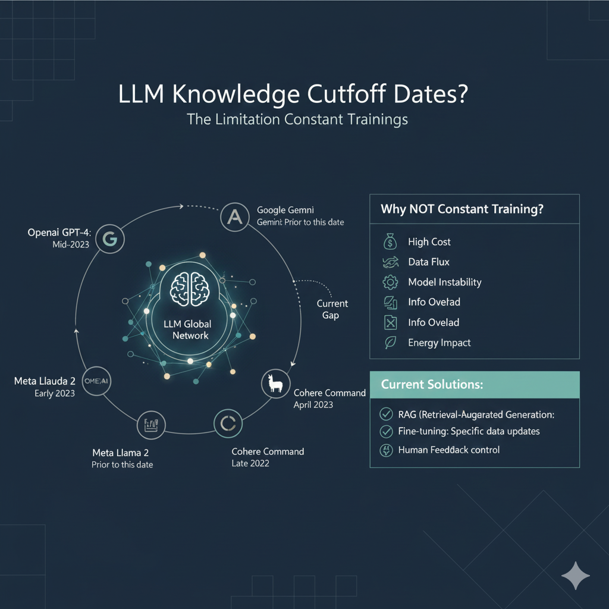

# 🔍 LLM App with Web Search Demo Application


This application demonstrates how to overcome LLM knowledge cutoffs by using real-time web search.

## 🧠 Why Web Search? (Understanding Cutoffs)

LLMs are like books written on a specific date; they don't know what happened after they were printed. Constant retraining is too expensive and slow. This app uses **RAG (Retrieval-Augmented Generation)** to fetch live data.



---

## Prerequisites

- **🐍 Python3.11**
- [🦙 Ollama](https://ollama.com/download)
- Download LLM model to use:
  ```sh
  ollama pull llama3.2
  ```
- Download embedding model:

    ```sh
    ollama pull nomic-embed-text:latest
    ```


## 🔨 Application Setup

Create a virtual environment and install all dependencies.

```sh
make setup
```

Activate virtual environment and run:

```sh
playwright install
```


## 🚀 Run the application

```sh
streamlit run app.py
```


# My changes
